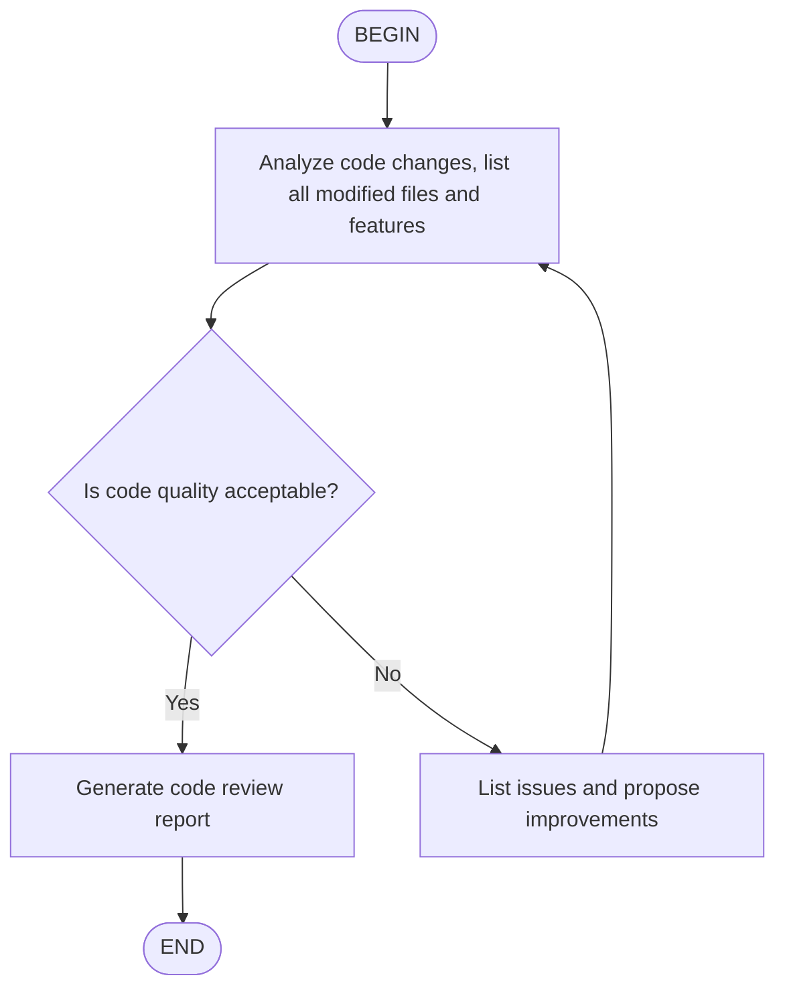

# Agent Skills 标准文档

> 本文档整合了 [Agent Skills 开放标准](https://agentskills.io/specification)、[Claude Code Skills 实现](https://code.claude.com/docs/en/skills)、[Kimi CLI Skills 实现](https://moonshotai.github.io/kimi-cli/en/customization/skills.html) 和 [OpenCode Skills 实现](https://opencode.ai/docs/zh-cn/skills/) 的核心内容，并提供深度对比分析。

---

## 目录

- [概述](#概述)
  - [核心优势](#核心优势)
  - [Skills 能做什么](#skills-能做什么)
  - [三种标准的关系](#三种标准的关系)
- [Skill 文件结构](#skill-文件结构)
  - [标准结构（Agent Skills）](#标准结构agent-skills)
  - [Claude Code 结构](#claude-code-结构)
  - [Kimi CLI 结构](#kimi-cli-结构)
  - [支持文件说明](#支持文件说明)
- [SKILL.md 格式规范](#skillmd-格式规范)
  - [YAML Frontmatter](#yaml-frontmatter)
  - [Frontmatter 字段参考](#frontmatter-字段参考)
  - [`name` 字段约束对比](#name-字段约束对比)
  - [`description` 要求](#description-要求)
  - [调用控制组合（Claude Code 特有）](#调用控制组合claude-code-特有)
  - [Markdown 内容](#markdown-内容)
- [Skill 发现与存放位置](#skill-发现与存放位置)
  - [Claude Code 四级优先级](#claude-code-四级优先级)
  - [OpenCode Skill 发现机制](#opencode-skill-发现机制)
  - [OpenCode 权限配置](#opencode-权限配置)
  - [Kimi CLI 分层加载机制](#kimi-cli-分层加载机制)
  - [存放位置对比总结](#存放位置对比总结)
- [渐进式披露](#渐进式披露)
- [Skill 调用方式](#skill-调用方式)
  - [Claude Code](#claude-code)
  - [Kimi CLI](#kimi-cli)
  - [调用方式对比](#调用方式对比)
- [Flow Skills（Kimi CLI 特有）](#flow-skillskimi-cli-特有)
  - [与普通 Skill 的区别](#与普通-skill-的区别)
  - [创建 Flow Skill](#创建-flow-skill)
  - [流程图格式](#流程图格式)
  - [执行 Flow Skill](#执行-flow-skill)
- [字符串替换变量](#字符串替换变量)
- [高级特性（Claude Code 特有）](#高级特性claude-code-特有)
  - [动态上下文注入](#动态上下文注入)
  - [在 Subagent 中运行](#在-subagent-中运行)
  - [Skills 与 Subagents 的关系](#skills-与-subagents-的关系)
- [平台支持](#平台支持)
- [工具权限](#工具权限)
- [验证工具（Agent Skills 特有）](#验证工具agent-skills-特有)
- [最佳实践](#最佳实践)
  - [命名规范](#命名规范)
  - [描述编写](#描述编写)
  - [内容组织](#内容组织)
  - [工具限制](#工具限制)
  - [跨平台兼容建议](#跨平台兼容建议)
- [故障排除](#故障排除)
- [选择建议](#选择建议)
  - [使用纯 Agent Skills 标准](#使用纯-agent-skills-标准当)
  - [使用 Claude Code 扩展](#使用-claude-code-扩展当)
  - [使用 Kimi CLI 扩展](#使用-kimi-cli-扩展当)
  - [使用 OpenCode 扩展](#使用-opencode-扩展当)
- [总结表](#总结表)
- [参考链接](#参考链接)

---

## 概述

**Agent Skills** 是包含指令、脚本和资源的文件夹，AI Agent 可以发现并使用它们来更准确、更高效地完成任务。

### 核心优势

| 角色 | 价值 |
|------|------|
| **Skill 作者** | 一次构建能力，部署到多个 Agent 产品 |
| **兼容 Agent** | 支持 skills 让终端用户开箱即用地赋予 Agent 新能力 |
| **团队/企业** | 将组织知识捕获为可移植、版本控制的包 |

### Skills 能做什么

- **领域专业知识**: 将专业领域知识打包为可复用指令（从法律审查流程到数据分析管道）
- **新能力**: 赋予 Agent 新能力（如创建演示文稿、构建 MCP 服务器、分析数据集）
- **可重复工作流**: 将多步骤任务转变为一致且可审计的工作流
- **互操作性**: 跨不同兼容 skills 的 Agent 产品复用相同 skill

### 三种标准的关系

| 维度 | Agent Skills 开放标准 | Claude Code Skills | Kimi CLI Skills | OpenCode |
|------|----------------------|-------------------|-----------------|----------|
| **定位** | 跨平台通用标准 | Claude Code 专属实现 | Kimi CLI 专属实现 | OpenCode 专属实现 |
| **关系** | 基础标准 | 扩展实现 | 扩展实现 | 扩展实现 |
| **目标** | 互操作性、可移植性 | 用户体验、高级功能 | 用户体验、分层加载 | 用户体验、权限控制 |
| **约束** | 严格、最小化 | 灵活、功能丰富 | 灵活、多目录支持 | 灵活、配置驱动 |

---

## Skill 文件结构

每个 Skill 是一个目录，`SKILL.md` 是必需的入口文件。

### 标准结构（Agent Skills）

```
skill-name/
├── SKILL.md          # 必需
├── scripts/          # 可执行代码
├── references/       # 附加文档
│   ├── REFERENCE.md
│   ├── FORMS.md
│   └── domain-specific.md
└── assets/           # 静态资源
    ├── templates/
    ├── images/
    └── data/
```

**特点：**
- 标准化目录命名（`scripts/`, `references/`, `assets/`）
- 每个目录有明确的用途划分
- 强调资源类型的分离

### Claude Code 结构

```
my-skill/
├── SKILL.md           # 必需
├── template.md        # 模板
├── examples/          # 示例
│   └── sample.md
└── scripts/
    └── validate.sh
```

**特点：**
- 更灵活的命名
- 强调 `examples/` 和 `template.md`
- 没有强制的 `references/` 和 `assets/` 目录

### Kimi CLI 结构

```
my-skill/
├── SKILL.md           # 必需
├── scripts/           # 可选：脚本文件
├── references/        # 可选：参考文档
└── assets/            # 可选：其他资源
```

**特点：**
- 与 Agent Skills 标准结构基本一致
- 推荐保持 `SKILL.md` 在 500 行以内
- 使用相对路径引用其他文件

### 支持文件说明

- `SKILL.md`: 包含主要指令，是必需的
- `template.md`: Claude 要填写的模板
- `examples/`: 显示预期格式的示例输出
- `scripts/`: 可执行脚本（Agent 决定支持的语言，常见 Python、Bash、JavaScript）
- `references/`: 详细参考文档（Agent Skills 标准）
- `assets/`: 静态资源如模板、图片、数据文件（Agent Skills 标准）

从 `SKILL.md` 中引用这些文件，以便 Agent 知道它们包含什么以及何时加载它们。

---

## SKILL.md 格式规范

### YAML Frontmatter（`---` 标记之间）

```yaml
---
name: my-skill
description: What this skill does and when to use it.
license: MIT
metadata:
  author: my-org
  version: "1.0"
---
```

#### Frontmatter 字段参考

| 字段 | Agent Skills | Claude Code | Kimi CLI | OpenCode | 说明 |
|------|-------------|-------------|----------|----------|------|
| `name` | **必填** | 可选 | 可选 | **必填** | Skill 显示名称，1-64字符，小写/数字/连字符 |
| `description` | **必填** | 推荐 | 推荐 | **必填** | 功能描述+使用时机，1-1024字符 |
| `license` | 可选 | ❌ | 可选 | 可选 | 许可证声明 |
| `compatibility` | 可选 | ❌ | 可选 | 可选 | 环境要求（1-500字符）|
| `metadata` | 可选 | ❌ | 可选 | 可选 | 扩展元数据键值对（OpenCode: 字符串到字符串映射）|
| `type` | ❌ | ❌ | **flow** | ❌ | Kimi 特有：设为 `flow` 表示 Flow Skill |
| `allowed-tools` | 实验性 | 支持 | ❌ | ❌ | 预批准工具列表 |
| `argument-hint` | ❌ | 支持 | ❌ | ❌ | 自动完成提示，如 `[issue-number]` |
| `disable-model-invocation` | ❌ | 支持 | ❌ | ❌ | 设为 `true` 禁止自动触发 |
| `user-invocable` | ❌ | 支持 | ❌ | ❌ | 设为 `false` 从 `/` 菜单隐藏 |
| `model` | ❌ | 支持 | ❌ | ❌ | Skill 激活时使用的模型 |
| `context` | ❌ | 支持 | ❌ | ❌ | 设为 `fork` 在 subagent 中运行 |
| `agent` | ❌ | 支持 | ❌ | ❌ | `context: fork` 时的 subagent 类型 |
| `hooks` | ❌ | 支持 | ❌ | ❌ | Skill 生命周期 hooks |

#### `name` 字段约束对比

| 平台 | 长度 | 字符限制 | 其他约束 |
|------|------|---------|---------|
| **Agent Skills** | 1-64 字符 | 小写字母、数字、连字符 | 不能首尾连字符，不能连续连字符，**必须与父目录名完全匹配** |
| **Claude Code** | 最多 64 字符 | 小写字母、数字、连字符 | 省略则使用目录名 |
| **Kimi CLI** | 1-64 字符 | 小写字母、数字、连字符 | 省略则使用目录名 |

#### `description` 要求

**Agent Skills（强制）：**
```yaml
# 必须同时描述：做什么 + 何时使用
description: Extracts text from PDFs. Use when working with PDF documents or when user mentions PDFs.
```
- 1-1024 字符
- 必须描述**做什么**和**何时使用**
- 应包含帮助 Agent 识别任务的关键词

**Claude Code：**
- 推荐但不强制
- 省略则使用 markdown 第一段

**Kimi CLI：**
- 推荐但不强制
- 省略则显示 "No description provided."

#### 调用控制组合（Claude Code 特有）

| Frontmatter | 用户可调用 `/name` | Claude 可自动调用 | 描述是否在上下文中 |
|-------------|-------------------|------------------|-------------------|
| （默认）| ✓ | ✓ | 始终在上下文中 |
| `disable-model-invocation: true` | ✓ | ✗ | 不在上下文中，调用时加载 |
| `user-invocable: false` | ✗ | ✓ | 始终在上下文中 |

### Markdown 内容

Skill 的具体指令，Agent 在调用时遵循。

#### 内容类型

**参考内容（Reference）**: 添加 Agent 应用于当前工作的知识

```markdown
---
name: api-conventions
description: API design patterns for this codebase
---

When writing API endpoints:
- Use RESTful naming conventions
- Return consistent error formats
- Include request validation
```

**任务内容（Task）**: 为 Agent 提供特定操作的分步说明

```markdown
---
name: deploy
description: Deploy the application to production
context: fork
disable-model-invocation: true
---

Deploy the application:
1. Run the test suite
2. Build the application
3. Push to the deployment target
```

---

## Skill 发现与存放位置

### Claude Code 四级优先级

| 级别 | 路径 | 适用范围 |
|------|------|----------|
| Enterprise | 托管设置 | 组织所有用户 |
| Personal | `~/.claude/skills/<skill-name>/SKILL.md` | 所有项目 |
| Project | `.claude/skills/<skill-name>/SKILL.md` | 仅当前项目 |
| Plugin | `<plugin>/skills/<skill-name>/SKILL.md` | 插件启用处 |

**优先级规则：**
- 当 skills 在不同级别共享相同名称时，**更高优先级的位置获胜**: enterprise > personal > project
- Plugin skills 使用 `plugin-name:skill-name` 命名空间，避免与其他级别冲突
- `.claude/commands/` 中的文件工作方式相同，但 skill 与 command 同名时 skill 优先

### OpenCode Skill 发现机制

OpenCode 从当前工作目录向上遍历，直到到达 git 工作树根目录，发现以下位置的 skills：

| 级别 | 路径 | 说明 |
|------|------|------|
| **项目配置** | `.opencode/skills/<name>/SKILL.md` | 项目本地 skills |
| **全局配置** | `~/.config/opencode/skills/<name>/SKILL.md` | 用户级全局 skills |
| **项目 Claude 兼容** | `.claude/skills/<name>/SKILL.md` | 与 Claude Code 兼容 |
| **全局 Claude 兼容** | `~/.claude/skills/<name>/SKILL.md` | 全局 Claude 兼容 |
| **项目代理兼容** | `.agents/skills/<name>/SKILL.md` | 与 Agent 标准兼容 |
| **全局代理兼容** | `~/.agents/skills/<name>/SKILL.md` | 全局 Agent 兼容 |

**发现规则：**
- 向上遍历到 git 根目录，加载所有匹配路径的 skills
- 同名 skill 按发现顺序覆盖（后发现的优先）
- 未知 frontmatter 字段会被忽略

### OpenCode 权限配置

在 `opencode.json` 中使用基于模式的权限控制代理可访问的技能：

```json
{
  "permission": {
    "skill": {
      "*": "allow",
      "pr-review": "allow",
      "internal-*": "deny",
      "experimental-*": "ask"
    }
  }
}
```

| 权限 | 行为 |
|------|------|
| `allow` | 技能立即加载 |
| `deny` | 对代理隐藏技能，拒绝访问 |
| `ask` | 加载前提示用户确认 |

**模式支持通配符：** `internal-*` 可匹配 `internal-docs`、`internal-tools` 等。

**按代理覆盖权限：**

为特定代理授予与全局默认值不同的权限：

```json
{
  "agent": {
    "plan": {
      "permission": {
        "skill": {
          "internal-*": "allow"
        }
      }
    }
  }
}
```

**禁用技能工具：**

为不需要使用技能的代理完全禁用技能功能：

```json
{
  "agent": {
    "plan": {
      "tools": {
        "skill": false
      }
    }
  }
}
```

禁用后，`<available_skills>` 部分将被完全省略。

### Kimi CLI 分层加载机制

Kimi CLI 使用分层加载机制发现 skills，按以下优先级顺序（后加载的覆盖同名 skills）：

**1. 内置 skills**
- 随包提供的 skills，提供基础能力
- 包括 `kimi-cli-help` 和 `skill-creator`

**2. 用户级 skills**（按优先级检查，使用第一个存在的）

| 优先级 | 路径 | 说明 |
|--------|------|------|
| 1 | `~/.config/agents/skills/` | 推荐路径 |
| 2 | `~/.agents/skills/` | 备选路径 |
| 3 | `~/.kimi/skills/` | Kimi 专属 |
| 4 | `~/.claude/skills/` | Claude Code 兼容 |
| 5 | `~/.codex/skills/` | Codex 兼容 |

**3. 项目级 skills**（按优先级检查，使用第一个存在的）

| 优先级 | 路径 | 说明 |
|--------|------|------|
| 1 | `.agents/skills/` | 推荐路径 |
| 2 | `.kimi/skills/` | Kimi 专属 |
| 3 | `.claude/skills/` | Claude Code 兼容 |
| 4 | `.codex/skills/` | Codex 兼容 |

**4. 自定义目录**
- 使用 `--skills-dir /path/to/my-skills` 指定
- 跳过用户级和项目级 skill 发现

**Kimi 多目录支持特点：**
- 跨工具兼容性：同时支持 `.agents/`、`.kimi/`、`.claude/`、`.codex/` 目录
- 分层覆盖：后加载的同名 skill 覆盖先加载的
- 独立配置：`KIMI_SHARE_DIR` 不影响 skills 搜索路径

### 存放位置对比总结

| 特性 | Claude Code | Kimi CLI | Codex |
|------|-------------|----------|-------|
| **用户级路径** | `~/.claude/skills/` | 多路径支持 | `~/.codex/skills/` |
| **项目级路径** | `.claude/skills/` | 多路径支持 | `.codex/skills/` |
| **企业级** | ✓ 支持 | ❌ | ❌ |
| **插件级** | ✓ 支持 | ❌ | ❌ |
| **自定义目录** | ❌ | ✓ `--skills-dir` | ❌ |
| **跨工具兼容** | ❌ | ✓ `.claude/`, `.codex/` | ❌ |

---

## 渐进式披露（Progressive Disclosure）

Agent Skills 推荐的内容加载策略：

| 层级 | 内容 | Token 预算 | 加载时机 |
|------|------|-----------|---------|
| **Metadata** | `name` + `description` | ~100 | 启动时，所有 skills |
| **Instructions** | `SKILL.md` body | < 5000 推荐 | Skill 激活时 |
| **Resources** | `scripts/`, `references/`, `assets/` | 按需 | 引用时 |

**约束：**
- 主 `SKILL.md` 建议 < 500 行
- 详细内容移至单独文件
- 保持文件引用一级深度

---

## Skill 调用方式

### Claude Code

- **自动调用**：AI 根据上下文自动决定是否读取 skill
- **手动调用**：`/<skill-name>` 或 `/skill:<skill-name>`
- **带参数**：`/<skill-name> <arguments>`

### Kimi CLI

- **自动调用**：AI 根据当前任务需要自动决定是否读取 SKILL.md
- **手动调用**：`/skill:<name>`
- **带参数**：`/skill:<name> <additional-text>`

**示例：**
```bash
/skill:code-style          # 加载代码风格指南
/skill:pptx               # 加载 PPT 创建工作流
/skill:git-commits fix user login issue  # 带额外任务描述
```

**注意**：附加文本会作为用户的具体请求添加到 skill prompt 中。

### 调用方式对比

| 平台 | 自动调用 | 手动调用 | 参数支持 |
|------|---------|---------|---------|
| **Claude Code** | ✓ | `/<name>` 或 `/skill:<name>` | ✓ |
| **Kimi CLI** | ✓ | `/skill:<name>` | ✓ |
| **Codex** | ✓ | `/skill:<name>` | ✓ |
| **OpenCode** | ✓ | `skill({ name: "<name>" })` | ❌ |

---

## Flow Skills（Kimi CLI 特有）

Flow skills 是一种特殊的 skill 类型，在 SKILL.md 中嵌入 Agent Flow 图表，用于定义多步骤自动化工作流。

### 与普通 Skill 的区别

| 特性 | 普通 Skill | Flow Skill |
|------|-----------|------------|
| **Frontmatter** | `type` 省略 | `type: flow` |
| **调用命令** | `/skill:<name>` | `/flow:<name>` |
| **执行方式** | 作为 prompt 加载 | 自动执行多轮对话 |
| **内容** | Markdown 指令 | Mermaid/D2 流程图 + 说明 |

### 创建 Flow Skill

```yaml
---
name: code-review
description: Code review workflow
type: flow
---


```

### 流程图格式

**支持格式：**
- **Mermaid**: 使用 ` ```mermaid ` 代码块，可用 Mermaid Playground 编辑预览
- **D2**: 使用 ` ```d2 ` 代码块，可用 D2 Playground 编辑预览

**流程图规则：**
- 必须包含一个 `BEGIN` 节点和一个 `END` 节点
- 普通节点文本作为 prompt 发送给 Agent
- 决策节点需要 Agent 输出 `<choice>branch name</choice>` 选择下一步

**D2 格式示例：**
```d2
BEGIN -> B -> C
B: Analyze existing code, write design doc for XXX feature
C: Review if design doc is detailed enough
C -> B: No
C -> D: Yes
D: Start implementation
D -> END
```

### 执行 Flow Skill

```bash
/flow:code-review    # 执行流程，从 BEGIN 节点开始自动执行直到 END
/skill:code-review   # 作为普通 skill 加载（不自动执行流程）
```

---

## 字符串替换变量

| 变量 | Agent Skills | Claude Code | Kimi CLI | 描述 |
|------|-------------|-------------|----------|------|
| `$ARGUMENTS` | ✓ | ✓ | ✓ | 调用时传递的所有参数 |
| `$ARGUMENTS[N]` | ✓ | ✓ | ✓ | 按 0 基索引访问特定参数 |
| `$N` | ✓ | ✓ | ✓ | `$ARGUMENTS[N]` 的简写 |
| `${CLAUDE_SESSION_ID}` | ❌ | ✓ | ❌ | 当前会话 ID |

### 使用示例

```markdown
---
name: fix-issue
description: Fix a GitHub issue
disable-model-invocation: true
---

Fix GitHub issue $ARGUMENTS following our coding standards.

1. Read the issue description
2. Understand the requirements
3. Implement the fix
4. Write tests
5. Create a commit
```

运行 `/fix-issue 123` 时，`$ARGUMENTS` 被替换为 `123`。

---

## 高级特性（Claude Code 特有）

### 1. 动态上下文注入

使用 `` !`command`` `` 语法在 skill 内容发送给 Claude 前运行 shell 命令，输出替换占位符：

```markdown
---
name: pr-summary
description: Summarize changes in a pull request
context: fork
agent: Explore
allowed-tools: Bash(gh *)
---

## Pull request context
- PR diff: !`gh pr diff`
- PR comments: !`gh pr view --comments`
- Changed files: !`gh pr diff --name-only`

## Your task
Summarize this pull request...
```

执行流程：
1. 每个 `` !`command`` `` 立即执行（Claude 看到内容前）
2. 输出替换 skill 内容中的占位符
3. Claude 接收具有实际数据的完全渲染的提示

### 2. 在 Subagent 中运行

添加 `context: fork` 让 skill 在隔离中运行。skill 内容变成驱动 subagent 的 prompt，无法访问对话历史。

```markdown
---
name: deep-research
description: Research a topic thoroughly
context: fork
agent: Explore
---

Research $ARGUMENTS thoroughly:

1. Find relevant files using Glob and Grep
2. Read and analyze the code
3. Summarize findings with specific file references
```

执行流程：
1. 创建新的隔离上下文
2. Subagent 接收 skill 内容作为其提示
3. `agent` 字段确定执行环境（模型、工具、权限）
4. 结果被总结并返回到主对话

**Agent 类型：**

| Agent 类型 | 用途 |
|-----------|------|
| `Explore` | 代码库探索（只读工具）|
| `Plan` | 计划制定 |
| `general-purpose` | 通用任务（默认）|

### Skills 与 Subagents 的关系

| 方法 | 系统提示 | 任务 | 同时加载 |
|------|----------|------|----------|
| 带 `context: fork` 的 Skill | 来自 agent 类型 | SKILL.md 内容 | CLAUDE.md |
| 带 `skills` 字段的 Subagent | Subagent 的 markdown 正文 | Claude 的委派消息 | 预加载的 skills + CLAUDE.md |

---

## 平台支持

Agent Skills 开放标准被以下 AI 开发工具支持：

- **Claude Code** - Anthropic 的 AI 编程助手
- **Codex** - OpenAI 的 CLI 编程助手
- **Kimi CLI** - Moonshot AI 的命令行工具
- **OpenCode** - 开源 AI 编程助手（通过 `skill` 工具原生支持）

---

## 工具权限

### `allowed-tools` 字段

**Agent Skills（实验性）：**
```yaml
allowed-tools: Bash(git:*) Bash(jq:*) Read
```
- 空格分隔
- 支持工具名 + 参数模式
- 标注为实验性，支持度因实现而异

**Claude Code：**
```yaml
allowed-tools: Read, Grep, Glob
```
- 逗号分隔
- 实现更成熟
- 支持动态权限控制

**Kimi CLI：**
- 暂不支持 `allowed-tools` 字段

---

## 验证工具（Agent Skills 特有）

```bash
skills-ref validate ./my-skill
```

- 检查 frontmatter 有效性
- 验证命名约定
- 标准提供的参考实现
- 建议在 CI/CD 中使用

---

## 最佳实践

### 命名规范

- 使用小写字母、数字、连字符
- 最大 64 字符
- 使用分类前缀便于区分：`dev-`, `life-`, `work-`, `tool-`, `learn-`
- **遵循 Agent Skills 标准**：`name` 必须与父目录名匹配

### 描述编写

- 包含用户会自然说的关键词
- 描述应具体，避免过于宽泛导致频繁触发
- **遵循 Agent Skills 标准**：同时说明"做什么"和"何时使用"
- 1-1024 字符

### 内容组织

- 保持 `SKILL.md` 专注要点（< 500 行）
- 大型参考文档放在单独文件，按需引用
- 复杂 skills 使用支持文件保持主 skill 简洁
- 详细内容放入 `references/`
- 可执行脚本放入 `scripts/`

### 工具限制

- 使用 `allowed-tools` 创建只读模式（`Read, Grep, Glob`）
- 谨慎授予 `Bash` 权限，尽量限制命令范围（`Bash(gh *)`）

### 跨平台兼容建议

编写兼容多平台的 skill：

```yaml
---
# Agent Skills 标准字段（核心，确保跨平台兼容）
name: my-skill
description: Does something useful. Use when...
license: MIT
compatibility: Designed for Claude Code, Kimi CLI and compatible agents
metadata:
  author: my-org
  version: "1.0"

# Claude Code 扩展字段（可选增强）
disable-model-invocation: false
user-invocable: true
allowed-tools: Read, Grep, Bash
---
```

**原则：**
1. 核心字段（`name`, `description`）遵循 Agent Skills 标准
2. 平台扩展字段作为可选增强
3. 使用 `metadata` 存储自定义数据
4. 使用 `license` 和 `compatibility` 声明元信息
5. 为跨平台兼容性做测试

---

## 故障排除

### OpenCode Skill 加载问题

如果某个 skill 没有显示：

1. 确认 `SKILL.md` 文件名全部为大写字母
2. 检查 frontmatter 是否包含 `name` 和 `description`
3. 确保技能名称在所有位置中唯一
4. 检查权限设置——设为 `deny` 的技能会对代理隐藏

### Skill 未触发

1. 检查描述是否包含用户会自然说的关键词
2. 验证 skill 是否出现在 `What skills are available?`
3. 尝试重新表述请求以更接近描述
4. 使用 `/<skill-name>` 或 `/skill:<name>` 直接调用

### Skill 触发过于频繁

1. 使描述更具体
2. 添加 `disable-model-invocation: true` 仅手动调用

### Claude 看不到所有 Skills

- Skill 描述加载到上下文，过多可能超过字符预算
- 预算在上下文窗口的 2% 处动态缩放，回退为 16,000 字符
- 运行 `/context` 检查排除的 skills 警告
- 设置 `SLASH_COMMAND_TOOL_CHAR_BUDGET` 环境变量覆盖限制

---

## 选择建议

### 使用纯 Agent Skills 标准当：

- 需要**跨平台兼容**（Claude Code, Codex, Kimi, OpenCode）
- 需要**严格的验证**（`skills-ref validate`）
- 需要声明**许可证**和**兼容性**
- Skill 需要**长期维护**和**广泛分发**
- 遵循**最小化原则**

### 使用 Claude Code 扩展当：

- 仅在 **Claude Code** 中使用
- 需要**高级调用控制**（`disable-model-invocation`, `user-invocable`）
- 需要 **Subagent 执行**（`context: fork`）
- 需要**动态上下文注入**（`` !`command`` ``）
- 需要**会话级功能**（`${CLAUDE_SESSION_ID}`）

### 使用 Kimi CLI 扩展当：

- 需要 **Flow Skills** 自动化工作流
- 需要**多目录兼容**（同时支持 `.claude/`, `.codex/` 路径）
- 需要**自定义 skills 目录**（`--skills-dir`）
- 需要**跨工具协作**（团队使用不同工具）

### 使用 OpenCode 扩展当：

- 需要**细粒度的权限控制**（`opencode.json` 配置）
- 需要**按代理配置**不同的 skill 权限
- 使用 **`.agents/` 或 `.claude/` 目录结构**已有 skills
- 需要**与 Claude Code / Kimi CLI 兼容**的 skill 目录

---

## 总结表

| 特性类别 | Agent Skills | Claude Code | Kimi CLI | OpenCode | 建议 |
|---------|-------------|-------------|----------|----------|------|
| **标准性质** | 开放标准 | 具体实现 | 具体实现 | 具体实现 | 核心遵循标准，扩展按需使用 |
| **必填字段** | `name`, `description` | 无 | 无 | `name`, `description` | 始终填写 `name` 和 `description` |
| `name` 约束 | 严格（匹配目录）| 宽松 | 宽松 | 严格（匹配目录）| 遵循标准约束 |
| `description` | 强制 | 推荐 | 推荐 | 强制 | 始终编写完整描述 |
| 许可证 | 支持 | ❌ | 支持 | 支持 | 开源 skill 建议添加 |
| 兼容性声明 | 支持 | ❌ | 支持 | 支持 | 跨平台 skill 建议添加 |
| Flow Skills | ❌ | ❌ | ✓ | ❌ | 需要自动化工作流时使用 |
| 调用控制 | ❌ | 支持 | ❌ | ✓ 权限配置 | Claude/OpenCode 专用时使用 |
| Subagent | ❌ | 支持 | ❌ | ❌ | 需要隔离执行时使用 |
| 动态注入 | ❌ | 支持 | ❌ | ❌ | 需要实时数据时使用 |
| 多目录支持 | ❌ | ❌ | ✓ | ✓ | 跨工具协作时使用 |
| 自定义目录 | ❌ | ✓ `--skills-dir` | ❌ | ❌ | 需要灵活路径时使用 |
| 权限配置 | ❌ | ❌ | ❌ | ✓ `opencode.json` | 需要细粒度控制时使用 |
| 验证工具 | `skills-ref` | ❌ | ❌ | ❌ | CI/CD 中验证标准合规性 |
| 目录命名 | 标准化 | 灵活 | 标准化 | 标准化 | 遵循标准目录结构 |

---

## 参考链接

- **Agent Skills Specification**: https://agentskills.io/specification
- **Agent Skills 官网**: https://agentskills.io/
- **Claude Code Skills 文档**: https://code.claude.com/docs/en/skills
- **Kimi CLI Skills 文档**: https://moonshotai.github.io/kimi-cli/en/customization/skills.html
- **OpenCode Skills 文档**: https://opencode.ai/docs/zh-cn/skills/
- **Agent Skills GitHub**: https://github.com/anthropics/skills

---

*本文档基于 2025 年初的官方文档整理，标准可能持续演进*
