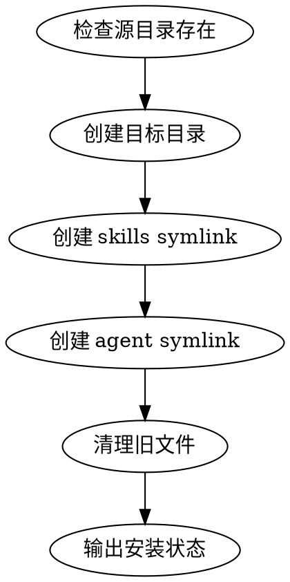

# 安装方式重构设计文档

## 概述

将原有的脚本安装方式（`scripts/install.sh` + `Makefile`）重构为 **Skill-based 安装**，使用 symlink 模式实现实时同步。

## 变更摘要

| 变更项 | 旧方式 | 新方式 |
|--------|--------|--------|
| 安装入口 | `./scripts/install.sh` 或 `make install` | `/skill:setup` |
| 技能路径 | `kimi/skills/` + `codex/skills/` | 仅 `kimi/skills/` |
| 安装机制 | 复制文件 | Symlink 到项目目录 |
| 配置同步 | 需手动更新 | 实时同步（symlink） |

## 目录结构

```
coding-everything/
├── .skills/
│   └── setup/
│       └── SKILL.md          # setup skill 定义
├── kimi/
│   ├── agents/superpower/    # → ~/.kimi/agents/superpower/
│   └── skills/               # → ~/.agents/skills/
└── [删除] codex/             # 与 kimi/skills/ 重复
└── [删除] scripts/install.sh # 被 skill 替代
└── [删除] Makefile           # 被 skill 替代
```

## Symlink 映射

| 源路径 | 目标路径 | 说明 |
|--------|----------|------|
| `$(pwd)/kimi/skills/` | `~/.agents/skills/` | 所有 Agent 工具共享 |
| `$(pwd)/kimi/agents/superpower/` | `~/.kimi/agents/superpower/` | Kimi Agent 配置 |

## setup skill 工作流程



## 优势

1. **实时同步**：修改项目中的 skill 文件立即生效，无需重新安装
2. **简化维护**：删除重复代码（install.sh、Makefile、codex/）
3. **统一路径**：所有工具共享 `~/.agents/skills/`
4. **符合标准**：遵循 Agent Skills 规范，使用 skill 驱动工作流

## 兼容性

- **Kimi CLI**：自动发现 `~/.agents/skills/` 和 `~/.kimi/agents/superpower/`
- **Codex**：自动发现 `~/.agents/skills/`
- **OpenCode**：自动发现 `~/.agents/skills/`

## 回滚方案

如需回滚到复制模式：
1. 删除 symlink
2. 恢复 `scripts/install.sh` 和 `Makefile`
3. 重新运行 `./scripts/install.sh`

---

*设计日期: 2025-02-27*
*状态: 已批准，待实施*
