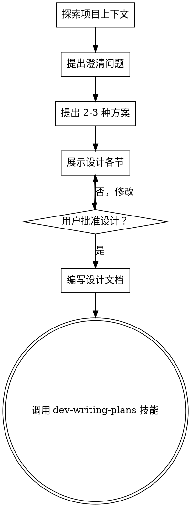

# 头脑风暴：从想法到设计

## 概述

通过自然协作对话，帮助将想法转化为完整的设计和规范。

首先了解当前项目上下文，然后一次提出一个问题来完善想法。一旦理解了要构建的内容，展示设计并获得用户批准。

<HARD-GATE>
在呈现设计并获得用户批准之前，**禁止**调用任何实现技能、编写任何代码、搭建任何项目或采取任何实现行动。这适用于**每个**项目，无论其看起来多么简单。
</HARD-GATE>

## 反模式："这个项目太简单了，不需要设计"

每个项目都必须经过此流程。一个待办事项列表、一个单功能工具、一个配置更改——所有这些都需要。所谓"简单"的项目正是未经审视的假设造成最多浪费工作的地方。设计可以很简短（真正简单的项目几句话即可），但你**必须**展示它并获得批准。

## 检查清单

你必须为以下每一项创建任务并按顺序完成：

1. **探索项目上下文** — 检查文件、文档、最近提交
2. **提出澄清问题** — 一次一个问题，理解目的/约束/成功标准
3. **提出 2-3 种方案** — 说明权衡并给出推荐
4. **展示设计** — 按复杂度分节展示，每节后获得用户批准
5. **编写设计文档** — 保存到 `docs/plans/YYYY-MM-DD-<主题>-design.md` 并提交
6. **过渡到实现** — 调用 dev-writing-plans 技能创建实施计划

## 流程图

**终止状态是调用 dev-writing-plans。** 不要调用 frontend-design、mcp-builder 或任何其他实现技能。brainstorming 之后**只能**调用 dev-writing-plans。

## 流程详解

**理解想法：**
- 首先检查当前项目状态（文件、文档、最近提交）
- 一次提出一个问题来完善想法
- 尽可能使用选择题，开放式问题也可以
- 每条消息只问一个问题 - 如果一个话题需要更多探索，分成多个问题
- 专注于理解：目的、约束、成功标准

**探索方案：**
- 提出 2-3 种不同方案并说明权衡
- 以对话方式呈现选项，给出推荐及理由
- 先提出推荐选项并解释原因

**展示设计：**
- 一旦理解了要构建的内容，开始展示设计
- 按复杂度调整每节长度：简单的几句话，复杂的 200-300 字
- 每节后询问是否正确
- 涵盖：架构、组件、数据流、错误处理、测试
- 如有不清楚的地方，随时返回澄清

## 设计完成后

**文档：**
- 将验证后的设计写入 `docs/plans/YYYY-MM-DD-<主题>-design.md`
- 如有可用的写作风格 skill，使用它来编写
- 将设计文档提交到 git

**实现：**
- 调用 dev-writing-plans 技能创建详细实施计划
- **不要**调用任何其他技能。dev-writing-plans 是下一步。

## 核心原则

- **一次一个问题** - 不要一次性提出多个问题
- **优先选择题** - 可能比开放式问题更容易回答
- **严格遵循 YAGNI** - 从所有设计中删除不必要的功能
- **探索替代方案** - 确定前先提出 2-3 种方案
- **增量验证** - 展示设计，获得批准后再继续
- **保持灵活** - 有不清楚的地方随时返回澄清
