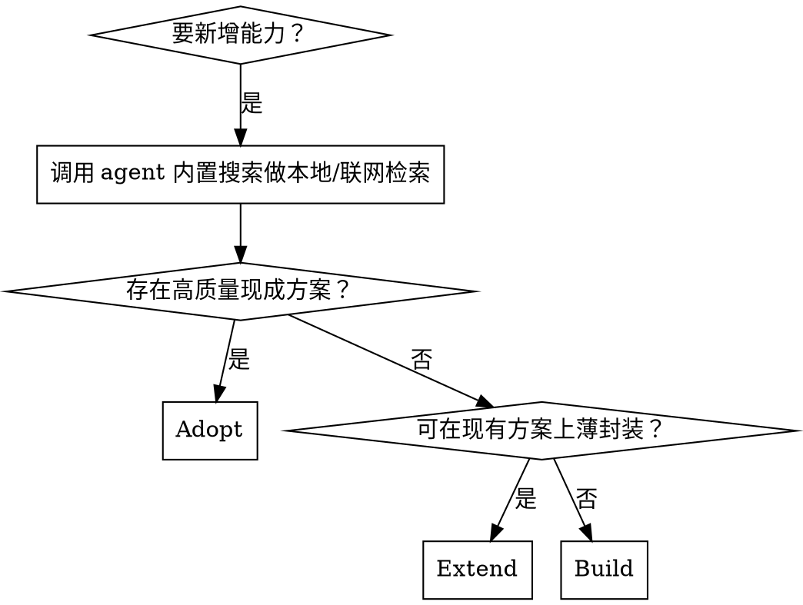

# Search First

## 概述

在写任何新代码前，先确认现成方案是否已经存在。

这个 skill 解决的是“先调研再实现”的 workflow，而不是替代具体实现 skill。

<EXTREMELY-IMPORTANT>
如果当前任务可能通过现有代码、现有依赖、现有 MCP、现有 skill 或成熟开源方案解决，就必须先完成检索，再决定是 Adopt、Extend 还是 Build。

不要先写代码再补搜索。不要把“我大概知道没有现成方案”当作完成检索。

本 skill 触发后，所有本地与联网检索都必须优先使用 agent 自带的搜索能力；需要查仓库内容时使用内置文件搜索/代码搜索，需要联网时使用内置网页搜索。
</EXTREMELY-IMPORTANT>

## 何时使用

- 新增功能，怀疑社区已有成熟方案
- 准备引入依赖、SDK、MCP、CLI 或服务集成
- 准备新建 utility、helper、wrapper、parser、adapter
- 用户要求“加一个能力”，但未限定必须自研
- 设计阶段需要先做技术选型或可行性判断

**不要用于：**
- 纯文案修改
- 已有明确计划且已验证必须自研的小改动

## 决策流程



## 工作流

复制并跟踪这份检查清单：

```text
Search-First Progress:
- [ ] Step 1: 明确需求边界与约束
- [ ] Step 2: 搜索仓库内已有实现
- [ ] Step 3: 搜索外部库 / MCP / skill / GitHub 模式
- [ ] Step 4: 对候选方案做结构化比较
- [ ] Step 5: 作出 Adopt / Extend / Build 决策
- [ ] Step 6: 把结论写回设计或实施方案
```

### Step 1: 明确需求边界与约束

至少写清：

- 目标能力是什么
- 技术栈约束是什么
- 是否允许新增依赖
- 是否有许可证、体积、维护性或离线要求

### Step 2: 搜索仓库内已有实现

先查当前仓库，再查上游 submodule。

必查：
- 是否已有相同或近似功能
- 是否已有脚本、命令、skill、模板可复用
- 是否已有测试覆盖同类行为

### Step 3: 搜索外部库 / MCP / skill / GitHub 模式

使用 agent 自带的联网搜索，至少覆盖：

- 官方库或官方文档
- 活跃开源实现
- 可直接复用的 skill 或 MCP
- 与当前技术栈兼容的参考实现

### Step 4: 结构化比较候选方案

最少比较这些维度：

| 维度 | 说明 |
| --- | --- |
| 功能匹配度 | 是否直接解决问题 |
| 维护状态 | 最近是否仍在维护 |
| 集成复杂度 | 接入成本、改造成本 |
| 依赖体积 | 是否引入过重依赖 |
| 许可证 | 是否可用 |
| 与仓库约束兼容性 | 是否违背项目规则 |

### Step 5: 作出 Adopt / Extend / Build 决策

- **Adopt**：现成方案直接满足需求，优先采用
- **Extend**：现成方案覆盖 60%-90%，做薄封装或小补丁
- **Build**：没有合适候选，或候选违背约束，再自研

### Step 6: 把结论写回设计或实施方案

输出必须包含：

- 搜索过哪些方向
- 评估过哪些候选
- 为什么选择 Adopt / Extend / Build
- 如果决定 Build，为什么现成方案不合格

## 输出模板

```markdown
## Search-First 结论

- Need:
- Constraints:
- Repo Findings:
- External Candidates:
- Recommendation: Adopt / Extend / Build
- Why:
- Risks:
```

## 反模式

- 没查仓库内已有实现就直接新建目录或文件
- 只搜一个方向就宣布“没有现成方案”
- 把“找到相似项目”误判为“可以直接照抄”
- 为小需求引入重型框架
- 明明可以 Adopt，却选择 Build
