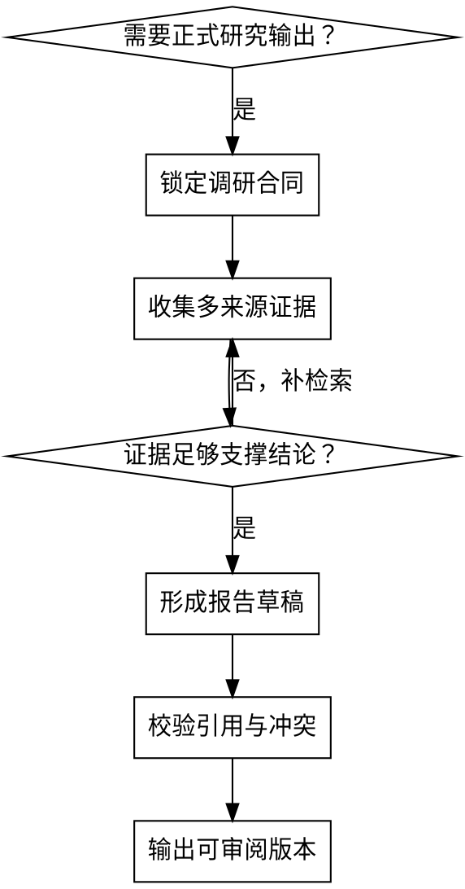

# Deep Research

## 概述

把“搜到一些资料”升级为“可复查、可引用、可交付”的研究输出。

这个 skill 适用于正式调研，不适用于随手查一个事实。

<EXTREMELY-IMPORTANT>
深度调研必须先锁定调研合同：范围、时间、地区、受众、输出格式、引用方式。

所有关键结论都要区分 `事实`、`推断`、`建议`。所有重要数字都必须有来源或明确标注为估算。

本 skill 触发后，联网检索统一调用 `tool-mgrep`。如果用户已有模板或章节结构，把它当作硬约束，不要擅自改写。
</EXTREMELY-IMPORTANT>

## 何时使用

- 用户要求研究报告、综述、brief、行业扫描
- 需要多来源交叉验证，而不是单条事实查询
- 需要结构化章节、引用、证据表
- 需要把研究结论转化为决策建议

**不要用于：**
- 单条事实问答
- 纯市场竞品扫描
- 只需要快速选型的工程问题

## 工作流

复制并跟踪这份检查清单：

```text
Deep-Research Progress:
- [ ] Step 1: 锁定调研合同
- [ ] Step 2: 拆分子问题与检索词
- [ ] Step 3: 收集证据并记录来源
- [ ] Step 4: 建立证据表
- [ ] Step 5: 形成大纲与章节映射
- [ ] Step 6: 起草完整报告
- [ ] Step 7: 校验引用、日期、冲突和空洞
- [ ] Step 8: 输出可审阅版本
```

## 调研流程图



### Step 1: 锁定调研合同

至少确认：

- Audience
- Purpose
- Scope
- Time Range
- Geography
- Required Sections
- Output Format
- Citation Style

### Step 2: 拆分子问题与检索词

把主问题拆成 3-7 个子问题，并为每个子问题准备：

- 关键实体
- 同义词
- 正向证据
- 反向证据
- 排除条件

需要细化检索计划时，加载 [references/research_plan_checklist.md](references/research_plan_checklist.md)。

### Step 3: 收集证据并记录来源

收集时优先：

- 官方来源
- 原始数据
- 时间更近的来源
- 能直接支撑结论的来源

每次记下：

- 标题
- 来源机构
- 日期
- URL
- 能支撑的具体主张

### Step 4: 建立证据表

最低字段：

| 字段 | 说明 |
| --- | --- |
| Source ID | 唯一编号 |
| Title | 标题 |
| Publisher | 发布方 |
| Date | 日期 |
| Claim | 可支撑的主张 |
| Confidence | 高 / 中 / 低 |

对来源质量拿不准时，按 [references/source_quality_rubric.md](references/source_quality_rubric.md) 做分层。

### Step 5: 形成大纲与章节映射

报告章节至少应覆盖：

1. Executive Summary
2. Key Findings
3. Evidence
4. Risks and Caveats
5. Recommendation
6. Sources

如果用户没有提供模板，优先以 [references/research_report_template.md](references/research_report_template.md) 为默认骨架。

### Step 6: 起草完整报告

要求：

- 先写完整草稿，再做删改
- 每个章节都要回链证据
- 英文术语可保留英文
- 不要把未经验证的推断写成事实

### Step 7: 校验引用、日期、冲突和空洞

交付前必须检查：

- 每个重要数字都有来源
- 过期数据被显式标注
- 互相冲突的来源被显式说明
- 结论能够从证据推出
- 未知项和证据空洞被保留下来，而不是脑补

格式、引用和完整性检查分别参考：

- [references/formatting_rules.md](references/formatting_rules.md)
- [references/completeness_review_checklist.md](references/completeness_review_checklist.md)

### Step 8: 输出可审阅版本

默认输出模板：

```markdown
# 标题

## Executive Summary
## Key Findings
## Evidence
## Risks and Caveats
## Recommendation
## Sources
```

## 质量门

- 事实、推断、建议已分层
- 重要结论可追溯到来源
- 日期与时间范围一致
- 没有把缺失信息伪装成确定结论

## 参考文件

| 文件 | 用途 |
| --- | --- |
| [references/research_plan_checklist.md](references/research_plan_checklist.md) | 拆分子问题与检索计划 |
| [references/source_quality_rubric.md](references/source_quality_rubric.md) | 来源分级与证据质量判断 |
| [references/research_report_template.md](references/research_report_template.md) | 默认研究报告骨架 |
| [references/formatting_rules.md](references/formatting_rules.md) | 结构、格式、引用规则 |
| [references/completeness_review_checklist.md](references/completeness_review_checklist.md) | 交付前完整性复核 |

## 反模式

- 先写结论，再倒找来源
- 只用单一来源支撑关键判断
- 没锁时间范围就混用旧数据和新数据
- 省略反例、下行风险和不确定性
- 把“信息不全”写成“结论明确”
