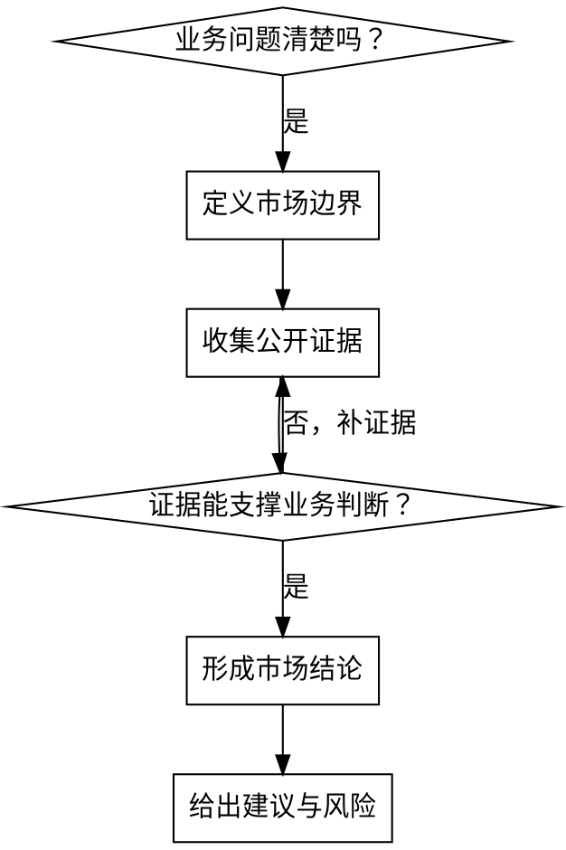

# Market Research

## 概述

面向业务决策的市场调研。

目标不是堆资料，而是帮助回答“要不要做、先做哪块、怎么切入”。

<EXTREMELY-IMPORTANT>
市场调研必须从业务决策问题出发，而不是从“我先搜点资料”出发。

所有市场结论都必须标明数据时间、地区范围、口径和不确定性。不要把营销文案、二手博客或旧报告当作市场事实。

本 skill 触发后，联网检索统一使用 agent 自带的网页搜索能力。如果用户已有行业数据、访谈记录或内部数据，优先把它们并入证据集。
</EXTREMELY-IMPORTANT>

## 何时使用

- 市场规模、细分赛道、增长趋势判断
- 竞品功能、定位、渠道、定价比较
- 区域机会、选址、地理密度、供需信号分析
- 用户需求、痛点、购买意愿的公开信号收集
- 进入策略、差异化定位、优先切入点判断

**不要用于：**
- 通用学术或技术综述
- 纯工程选型
- 只查单个公司事实

## 工作流

复制并跟踪这份检查清单：

```text
Market-Research Progress:
- [ ] Step 1: 明确业务决策问题
- [ ] Step 2: 定义市场边界与细分维度
- [ ] Step 3: 收集公开市场证据
- [ ] Step 4: 做竞品 / 价格 / 区域 / 需求分析
- [ ] Step 5: 给出市场判断与建议
- [ ] Step 6: 标注风险、假设和待验证项
```

## 决策流程



### Step 1: 明确业务决策问题

先问清楚最终要支持什么决定：

- 是否进入这个市场
- 优先做哪个细分
- 价格怎么定
- 和谁竞争
- 先做哪个地区

### Step 2: 定义市场边界与细分维度

至少写清：

- 地区
- 时间范围
- 客群
- 品类边界
- 竞品集合
- 价格口径

### Step 3: 收集公开市场证据

优先收集：

- 官方统计或行业报告
- 公司官网价格页、产品页、公开案例
- 应用商店、评论站、地图平台、社媒公开信号
- 招聘、融资、合作、渠道等间接市场信号

每条证据都记录：

- 来源
- 日期
- 地区
- 口径
- 能说明什么

### Step 4: 做竞品 / 价格 / 区域 / 需求分析

按任务选择一个或多个分析面：

| 分析面 | 关注点 |
| --- | --- |
| 竞品 | 定位、功能、渠道、品牌叙事、强弱项 |
| 价格 | 套餐、区间、计费方式、折扣策略 |
| 区域 | 密度、供给、评论量、增长信号 |
| 需求 | 用户痛点、频繁抱怨、未满足需求 |

### Step 5: 给出市场判断与建议

输出至少回答：

- 市场是否值得进入
- 最可行的切入口是什么
- 主要竞争压力在哪里
- 建议先验证什么

### Step 6: 标注风险、假设和待验证项

必须显式区分：

- **事实**：有来源支撑
- **推断**：基于事实得出的判断
- **建议**：基于推断的动作
- **待验证项**：还缺证据的部分

## 输出模板

```markdown
# 市场调研主题

## Executive Summary
## Market Definition
## Competitive Landscape
## Pricing / Geography / Demand Signals
## Implications
## Risks and Open Questions
## Recommendation
## Sources
```

## 质量门

- 所有关键数字都有时间和口径
- 竞品比较不是照抄营销文案
- 建议能回溯到证据
- 风险和反证没有被省略

## 反模式

- 没有业务问题，直接开始搜
- 把 TAM 幻觉当成市场验证
- 用单一竞品推出整个市场结论
- 混用不同地区、不同年份、不同口径的数据
- 只给信息汇总，不给业务判断
