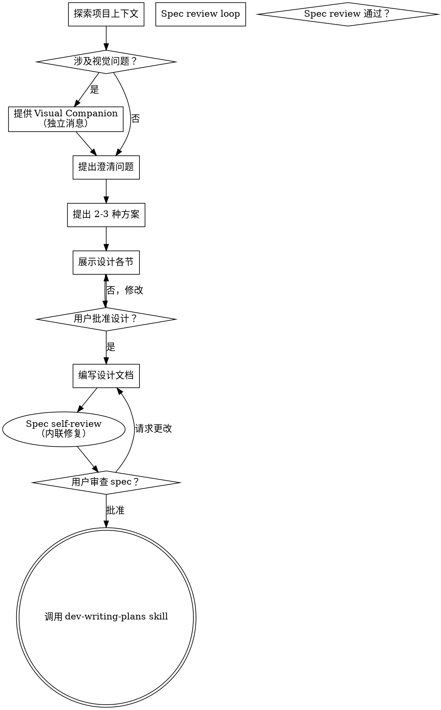

# 头脑风暴：从想法到设计

## 概述

通过自然协作对话，帮助将想法转化为完整的设计和规范。

首先了解当前项目上下文，然后一次提出一个问题来完善想法。一旦理解了要构建的内容，展示设计并获得用户批准。

<HARD-GATE>
在呈现设计并获得用户批准之前，**禁止**调用任何实现 skill、编写任何代码、搭建任何项目或采取任何实现行动。这适用于**每个**项目，无论其看起来多么简单。
</HARD-GATE>

## 反模式："这个项目太简单了，不需要设计"

每个项目都必须经过此流程。一个待办事项列表、一个单功能工具、一个配置更改——所有这些都需要。所谓"简单"的项目正是未经审视的假设造成最多浪费工作的地方。设计可以很简短（真正简单的项目几句话即可），但你**必须**展示它并获得批准。

## 检查清单

你必须为以下每一项创建任务并按顺序完成：

1. **探索项目上下文** — 使用 subagent 并发调研：项目代码搜索 + context7 查技术文档 + 网络搜索查成熟方案。先调研再决策。
2. **提供 Visual Companion**（浏览器可视化工具，如果涉及 mockup/图表/布局问题）— 这是独立的消息，不与其他澄清问题合并。详见下方说明。
3. **提出澄清问题** — 一次一个问题，理解目的/约束/成功标准
4. **提出 2-3 种方案** — 说明权衡并给出推荐
5. **展示设计** — 按复杂度分节展示，每节后获得用户批准
6. **编写设计文档** — 保存到 `docs/plans/YYYY-MM-DD-<主题>-design.md` 并提交到 git
7. **Spec self-review** — 快速内联检查：占位符扫描、内部一致性、范围检查、模糊性检查（见下方说明）
8. **用户审查 gate** — spec review loop 通过后，请用户审查书面 spec 再 proceed
9. **过渡到实现** — 调用 dev-writing-plans skill 创建实施计划

## 流程图



**终止状态是调用 dev-writing-plans。** 不要调用 frontend-design、mcp-builder 或任何其他实现技能。brainstorming 之后**只能**调用 dev-writing-plans。

## The Process

**理解想法：**

首先进行结构化调研，**必须使用 subagent 并发调研**，禁止串行探索浪费上下文。

**可用调研工具（按场景选用，不强依赖任何单一工具）：**

| 工具 | 适用场景 | 可替代 |
|------|---------|--------|
| `auggie-mcp codebase-retrieval` | 语义搜索项目代码，理解已有实现 | Grep / Glob / Read |
| `context7`（resolve-library-id → query-docs） | 查询第三方库的最新官方文档和 API | WebSearch + WebFetch |
| `mcp__zai-web-search-prime__web_search_prime` | 网络搜索成熟方案、开源实现、社区讨论 | WebSearch |
| `mcp__zai-github-read__search_doc` | 搜索 GitHub 仓库的文档、issues、commits | WebSearch |
| `mcp__zai-web-reader__webReader` | 深度阅读搜索结果中的关键页面 | WebFetch |

根据调研维度拆分 subagent，个数按实际需要决定，相互独立的调研维度就并发跑：

```
示例：用户想给项目加一个 OAuth 登录功能

并行启动 subagent（3 个独立维度）：
├── Agent A: Grep/Glob 搜索项目 → 是否已有 auth 相关代码、中间件、session 管理
├── Agent B: context7 查文档 → 技术栈对应的 OAuth 库最新 API（如 next-auth v5）
└── Agent C: web search → 社区最佳实践、同类项目如何实现、常见踩坑点

汇总 → 发现项目已有 session 中间件可复用 + next-auth v5 API 变化大
     → 方案：Extend 现有中间件 + context7 确认 v5 写法
```

**调研纪律：**
- 优先查现有方案，而不是默认新写：现有代码、现有脚本、现有 skill、上游实现、第三方工具
- 如果一个需求 80% 可以通过已有方案吸收或改造，就把"复用/适配"作为正式候选方案之一
- 调研结果必须包含：搜索过哪些方向、评估过哪些候选、为什么选择 Adopt / Extend / Build
- 不要只搜一个方向就宣布"没有现成方案"，至少覆盖本地代码 + 外部库 + 社区方案三个维度
- 某个工具不可用时，用"可替代"列的工具补位，不要因此阻塞调研

**澄清想法：**
- 一次提出一个问题来完善想法
- **优先使用询问用户的工具**（如 AskUserQuestion 等交互式提问工具）— 结构化选项展示体验更好
- 如果存在此类工具，用它来呈现选项；如果没有，再以对话方式提问
- 每条消息只问一个问题 - 如果一个话题需要更多探索，分成多个问题
- 专注于理解：目的、约束、成功标准

**提问格式要求：**
- 如果工具支持，为每个选项提供预览/预览字段展示关键信息（代码片段、mockup、配置示例等）
- **必须标明推荐选项**，并在描述中给出推荐理由
- 示例结构：
  ```
  选项 A: 方案名称 (Recommended)
  描述：简要说明 + 为什么推荐这个方案（理由）
  预览：关键代码/配置/效果展示

  选项 B: 备选方案
  描述：简要说明 + 适用场景或劣势
  预览：对比展示
  ```

**探索方案：**
- 提出 2-3 种不同方案并说明权衡
- **优先使用询问用户的工具**（如存在）— 结构化呈现选项，确保用户体验一致
- 每个方案选项必须包含：
  - 方案名称，**推荐项必须标注** `(Recommended)`
  - 说明方案 + **推荐理由/权衡分析**
  - 如工具支持预览功能，展示代码片段、配置示例、架构图等辅助决策
- 选项顺序：推荐方案放在第一个，其他按优先级排序

**展示设计：**
- 一旦理解了要构建的内容，开始展示设计
- 按复杂度调整每节长度：简单的几句话，复杂的 200-300 字
- 每节后询问是否正确
- 涵盖：架构、组件、数据流、错误处理、测试
- 如有不清楚的地方，随时返回澄清

## 设计完成后

**文档：**
- 将验证后的设计写入 `docs/plans/YYYY-MM-DD-<主题>-design.md`
- 如有可用的写作风格 skill，使用它来编写

**Spec Self-Review（内联自审）：**
写完设计文档后，用 fresh eyes 快速检查：

1. **占位符扫描**：任何 "TBD"、"TODO"、不完整章节或模糊需求？立即修复。
2. **内部一致性**：各章节是否相互矛盾？架构是否与功能描述匹配？
3. **范围检查**：是否足够聚焦于单个实施计划，还是需要分解？
4. **模糊性检查**：任何需求是否有两种理解方式？如有，明确选择一种。

直接 inline 修复问题，无需重新分派 reviewer。修复后继续下一步。

**用户审查 Gate：**
Spec review loop 通过后，请用户在继续之前审查书面 spec：

> "Spec 已写入并提交到 `<path>`。请审查它，如果需要在开始编写实施计划之前做任何更改，请告诉我。"

等待用户的回复。如果他们请求更改，进行更改并重新运行 spec review loop。只有在用户批准后才能继续。

**实现：**
- 调用 dev-writing-plans skill 创建详细实施计划
- **不要**调用任何其他 skill。dev-writing-plans 是下一步。

## 核心原则

- **一次一个问题** - 不要一次性提出多个问题
- **优先使用询问用户的工具** - 如存在此类工具，用它结构化展示选项，包含推荐标记和理由
- **优先选择题** - 可能比开放式问题更容易回答
- **严格遵循 YAGNI** - 从所有设计中删除不必要的功能
- **探索替代方案** - 确定前先提出 2-3 种方案
- **增量验证** - 展示设计，获得批准后再继续
- **保持灵活** - 有不清楚的地方随时返回澄清

## Visual Companion（浏览器可视化工具）

Visual Companion 是一个基于浏览器的可视化辅助工具，用于在头脑风暴期间展示 mockups、图表和视觉选项。作为工具提供 —— 不是一种模式。接受它意味着可以用于受益于视觉处理的问题；并不意味着每个问题都通过浏览器。

**提供 Visual Companion：** 当你预期即将到来的问题将涉及视觉内容（mockups、布局、图表）时，一次性征求同意：
> "我们正在处理的一些内容，如果我能在 web 浏览器中展示给你，可能会更容易解释。我可以在进行过程中整理 mockups、图表、比较和其他视觉内容。这个功能仍然很新，可能会消耗大量 token。想试试吗？（需要打开本地 URL）"

**此提议必须是独立的消息。** 不要将其与澄清问题、上下文总结或任何其他内容合并。消息应该只包含上面的提议，其他什么都没有。等待用户的回复后再继续。如果他们拒绝，继续仅使用文本进行头脑风暴。

**每个问题的决策：** 即使在接受后，也要为**每个问题**决定是使用浏览器还是终端。测试：**用户通过看会比读更理解这个吗？**

- **使用浏览器** 处理视觉内容 —— mockups、线框、布局比较、架构图、并排的视觉设计
- **使用终端** 处理文本内容 —— 需求问题、概念选择、权衡列表、A/B/C/D 文本选项、范围决策

关于 UI 主题的问题不自动是视觉问题。"在这个上下文中 personality 是什么意思？" 是一个概念问题 —— 使用终端。"哪个向导布局更好？" 是一个视觉问题 —— 使用浏览器。

如果用户同意使用，在继续之前阅读详细指南：
`skills/dev-brainstorming/visual-companion.md`
