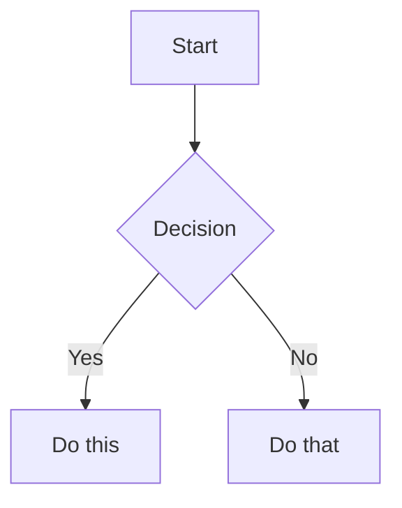

# Obsidian Flavored Markdown Skill

创建和编辑合法的 Obsidian Flavored Markdown。Obsidian 在 CommonMark 和 GFM 之上扩展了 wikilink、嵌入、callout、properties、注释等语法。这个 skill 只覆盖 Obsidian 专属扩展，标准 Markdown（标题、粗体、斜体、列表、引用、代码块、表格）默认视为已知内容。

## Workflow: Creating an Obsidian Note

1. **Add frontmatter**，在文件顶部加入 properties（title、tags、aliases）。所有 property 类型见 [PROPERTIES.md](references/PROPERTIES.md)。
2. **Write content**，使用标准 Markdown 组织结构，并结合下方的 Obsidian 专属语法。
3. **Link related notes**，使用 wikilink（`[[Note]]`）建立 vault 内部连接，外部 URL 则使用标准 Markdown 链接。
4. **Embed content**，通过 `![[embed]]` 语法嵌入其他笔记、图片或 PDF。所有嵌入类型见 [EMBEDS.md](references/EMBEDS.md)。
5. **Add callouts**，通过 `> [!type]` 语法添加高亮信息块。所有 callout 类型见 [CALLOUTS.md](references/CALLOUTS.md)。
6. **Verify**，确认该笔记在 Obsidian 的阅读视图中渲染正确。

> 在 wikilink 和 Markdown 链接之间做选择时：vault 内部笔记使用 `[[wikilinks]]`（Obsidian 会自动跟踪重命名），外部 URL 仅使用 `[text](url)`。

## Internal Links (Wikilinks)

```markdown
[[Note Name]]                          Link to note
[[Note Name|Display Text]]             Custom display text
[[Note Name#Heading]]                  Link to heading
[[Note Name#^block-id]]                Link to block
[[#Heading in same note]]              Same-note heading link
```

通过在任意段落后追加 `^block-id` 来定义块 ID：

```markdown
This paragraph can be linked to. ^my-block-id
```

对于列表和引用块，把块 ID 放在该块之后的单独一行：

```markdown
> A quote block

^quote-id
```

## Embeds

在任意 wikilink 前加上 `!` 即可内联嵌入其内容：

```markdown
![[Note Name]]                         Embed full note
![[Note Name#Heading]]                 Embed section
![[image.png]]                         Embed image
![[image.png|300]]                     Embed image with width
![[document.pdf#page=3]]               Embed PDF page
```

音频、视频、搜索嵌入和外部图片见 [EMBEDS.md](references/EMBEDS.md)。

## Callouts

```markdown
> [!note]
> Basic callout.

> [!warning] Custom Title
> Callout with a custom title.

> [!faq]- Collapsed by default
> Foldable callout (- collapsed, + expanded).
```

常见类型：`note`、`tip`、`warning`、`info`、`example`、`quote`、`bug`、`danger`、`success`、`failure`、`question`、`abstract`、`todo`。

完整列表、别名、嵌套和自定义 CSS callout 见 [CALLOUTS.md](references/CALLOUTS.md)。

## Properties (Frontmatter)

```yaml
---
title: My Note
date: 2024-01-15
tags:
  - project
  - active
aliases:
  - Alternative Name
cssclasses:
  - custom-class
---
```

默认 properties：`tags`（可搜索标签）、`aliases`（用于链接建议的别名）、`cssclasses`（用于样式的 CSS 类）。

所有 property 类型、tag 语法规则和高级用法见 [PROPERTIES.md](references/PROPERTIES.md)。

## Tags

```markdown
#tag                    Inline tag
#nested/tag             Nested tag with hierarchy
```

标签可以包含字母、数字（不能作为首字符）、下划线、连字符和正斜杠。标签也可以定义在 frontmatter 的 `tags` 属性中。

## Comments

```markdown
This is visible %%but this is hidden%% text.

%%
This entire block is hidden in reading view.
%%
```

## Obsidian-Specific Formatting

```markdown
==Highlighted text==                   Highlight syntax
```

## Math (LaTeX)

```markdown
Inline: $e^{i\pi} + 1 = 0$

Block:
$$
\frac{a}{b} = c
$$
```

## Diagrams (Mermaid)

````markdown

````

如果要把 Mermaid 节点链接到 Obsidian 笔记，给节点加上 `class NodeName internal-link;`。

## Footnotes

```markdown
Text with a footnote[^1].

[^1]: Footnote content.

Inline footnote.^[This is inline.]
```

## Complete Example

````markdown
---
title: Project Alpha
date: 2024-01-15
tags:
  - project
  - active
status: in-progress
---

# Project Alpha

This project aims to [[improve workflow]] using modern techniques.

> [!important] Key Deadline
> The first milestone is due on ==January 30th==.

## Tasks

- [x] Initial planning
- [ ] Development phase
  - [ ] Backend implementation
  - [ ] Frontend design

## Notes

The algorithm uses $O(n \log n)$ sorting. See [[Algorithm Notes#Sorting]] for details.

![[Architecture Diagram.png|600]]

Reviewed in [[Meeting Notes 2024-01-10#Decisions]].
````

## References

- [Obsidian Flavored Markdown](https://help.obsidian.md/obsidian-flavored-markdown)
- [Internal links](https://help.obsidian.md/links)
- [Embed files](https://help.obsidian.md/embeds)
- [Callouts](https://help.obsidian.md/callouts)
- [Properties](https://help.obsidian.md/properties)
